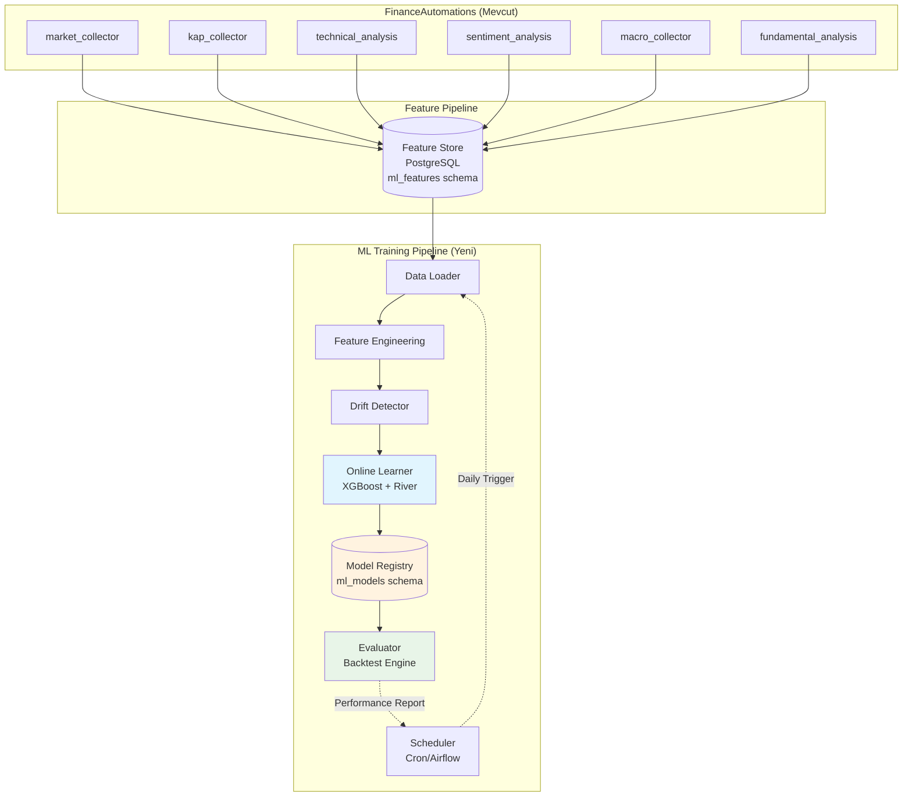

# ML Training Pipeline Architecture

## Financial Model Training System for FinanceAutomations

**Version:** 1.0  
**Date:** 2026-07-29  
**Status:** Draft  
**Author:** Architecture Design

---

## 1. Executive Summary

Bu doküman, FinanceAutomations projesi için **sürekli öğrenen (online learning)** bir finans modeli eğitim pipeline'ı tasarımını detaylandırır.

### 1.1 Hedefler

| Hedef | Değer |
|-------|-------|
| Annual Return Target | Enflasyon + %5-10 (~%25-35) |
| Learning Type | Online/Continuous Learning |
| Model Scope | Fiyat tahmini + Portföy optimizasyonu |
| Deployment | Decision engine'e entegre YOK (ayrı train-only) |

### 1.2 Mevcut Durum Analizi

Proje zaten aşağıdaki veri kaynaklarını toplamaktadır:

```
┌─────────────────────────────────────────────────────────────────┐
│                    MEVCUT VERİ KAYNAKLARI                         │
├─────────────────┬───────────────────────────────────────────────┤
│ market_collector │ Fiyat (tick/1d), hacim, bid/ask              │
│ kap_collector    │ Bilanço, gelir tablosu, KAP duyuruları       │
│ tefas_collector  │ Fon fiyatları, getiriler, fon flows          │
│ news_collector   │ Haber metinleri                              │
│ macro_collector  │ Faiz, enflasyon, PMI, TCMB verileri          │
├─────────────────┼───────────────────────────────────────────────┤
│ technical_analysis│ RSI, MACD, Bollinger, SMA/EMA, ATR, VWAP    │
│ fundamental_analysis│ P/E, P/B, ROE, debt/equity, marjlar       │
│ sentiment_analysis │ Haber duyarlılık skorları                   │
│ macro_analysis    │ Regime detection, surprise detection          │
└─────────────────┴───────────────────────────────────────────────┘
```

---

## 2. Sistem Mimarisi

### 2.1 Yüksek Seviye Görünüm



### 2.2 Bileşen Detayları

#### 2.2.1 Feature Store (`ml_features` schema)

```sql
-- Training window'da kullanılacak feature tablosu
CREATE TABLE ml_features.daily_features (
    id BIGSERIAL PRIMARY KEY,
    ticker VARCHAR(5) NOT NULL,
    feature_date DATE NOT NULL,
    
    -- Technical indicators (from analysis.technical_indicators)
    rsi_14 NUMERIC(8,4),
    macd_line NUMERIC(18,4),
    macd_signal NUMERIC(18,4),
    macd_histogram NUMERIC(18,4),
    sma_20 NUMERIC(18,4),
    sma_50 NUMERIC(18,4),
    sma_200 NUMERIC(18,4),
    bollinger_upper NUMERIC(18,4),
    bollinger_lower NUMERIC(18,4),
    bollinger_percent NUMERIC(8,4),
    atr_14 NUMERIC(18,4),
    adx_14 NUMERIC(8,4),
    stochastic_k NUMERIC(8,4),
    stochastic_d NUMERIC(8,4),
    williams_r NUMERIC(8,4),
    cci_20 NUMERIC(8,4),
    mfi_14 NUMERIC(8,4),
    obv NUMERIC(20,4),
    vwap NUMERIC(18,4),
    
    -- Price-based features
    return_1d NUMERIC(8,4),
    return_5d NUMERIC(8,4),
    return_20d NUMERIC(8,4),
    volatility_20d NUMERIC(8,4),
    volume_ratio_20d NUMERIC(8,4),
    
    -- Fundamental ratios (from fundamental_analysis)
    pe_ratio NUMERIC(10,4),
    pb_ratio NUMERIC(10,4),
    ps_ratio NUMERIC(10,4),
    ev_ebitda NUMERIC(10,4),
    roe NUMERIC(8,4),
    roa NUMERIC(8,4),
    debt_equity NUMERIC(10,4),
    current_ratio NUMERIC(10,4),
    gross_margin NUMERIC(8,4),
    operating_margin NUMERIC(8,4),
    net_margin NUMERIC(8,4),
    revenue_growth NUMERIC(8,4),
    earnings_growth NUMERIC(8,4),
    
    -- Sentiment features
    news_sentiment_7d NUMERIC(8,4),
    news_count_7d INTEGER,
    news_sentiment_30d NUMERIC(8,4),
    news_count_30d INTEGER,
    kap_sentiment_7d NUMERIC(8,4),
    
    -- Macro features
    usdtry_change_1d NUMERIC(8,4),
    usdtry_change_5d NUMERIC(8,4),
    interest_rate_change NUMERIC(8,4),
    inflation_12m NUMERIC(8,4),
    bist100_return_1d NUMERIC(8,4),
    bist100_return_5d NUMERIC(8,4),
    regime_encoded INTEGER,  -- 0=RANGE, 1=BULL, 2=BEAR, 3=CRISIS
    
    -- Target variable (next day return class)
    target_class INTEGER,  -- -1=BEARISH, 0=NEUTRAL, 1=BULLISH
    target_return NUMERIC(8,4),
    
    created_at TIMESTAMPTZ NOT NULL DEFAULT NOW(),
    UNIQUE(ticker, feature_date)
);

-- Feature importance tracking
CREATE TABLE ml_features.feature_importance (
    id BIGSERIAL PRIMARY KEY,
    model_version VARCHAR(20) NOT NULL,
    feature_name VARCHAR(50) NOT NULL,
    importance_score NUMERIC(10,6) NOT NULL,
    updated_at TIMESTAMPTZ NOT NULL DEFAULT NOW()
);

-- Model performance tracking
CREATE TABLE ml_models.model_metrics (
    id BIGSERIAL PRIMARY KEY,
    model_name VARCHAR(50) NOT NULL,
    model_version VARCHAR(20) NOT NULL,
    metric_name VARCHAR(50) NOT NULL,
    metric_value NUMERIC(10,6) NOT NULL,
    evaluation_date DATE NOT NULL,
    created_at TIMESTAMPTZ NOT NULL DEFAULT NOW()
);
```

#### 2.2.2 Model Registry Schema

```sql
CREATE SCHEMA IF NOT EXISTS ml_models;

-- Trained models metadata
CREATE TABLE ml_models.registered_models (
    id BIGSERIAL PRIMARY KEY,
    model_name VARCHAR(50) NOT NULL,
    model_version VARCHAR(20) NOT NULL,
    model_type VARCHAR(20) NOT NULL,  -- 'XGBOOST', 'RIVER', 'LSTM'
    model_path TEXT NOT NULL,  -- S3/local path to model file
    hyperparameters JSONB NOT NULL,
    training_start_date DATE NOT NULL,
    training_end_date DATE NOT NULL,
    is_active BOOLEAN DEFAULT FALSE,
    created_at TIMESTAMPTZ NOT NULL DEFAULT NOW(),
    UNIQUE(model_name, model_version)
);

-- Prediction outputs (for analysis)
CREATE TABLE ml_models.predictions (
    id BIGSERIAL PRIMARY KEY,
    ticker VARCHAR(5) NOT NULL,
    prediction_date DATE NOT NULL,
    model_version VARCHAR(20) NOT NULL,
    predicted_class INTEGER,  -- -1, 0, 1
    predicted_probability NUMERIC(8,4),  -- P(class=1)
    actual_class INTEGER,
    is_correct BOOLEAN,
    created_at TIMESTAMPTZ NOT NULL DEFAULT NOW(),
    UNIQUE(ticker, prediction_date, model_version)
);
```

---

## 3. Feature Engineering Stratejisi

### 3.1 Feature Kategorileri

| Kategori | Sayı | Örnekler |
|----------|------|----------|
| **Technical** | ~25 | RSI, MACD, Bollinger, SMA, ATR, ADX, Stochastic |
| **Price-based** | ~10 | Returns (1d,5d,20d), Volatility, Volume ratio |
| **Fundamental** | ~15 | P/E, P/B, ROE, Debt/Equity, Margins |
| **Sentiment** | ~6 | News sentiment (7d, 30d), KAP sentiment |
| **Macro** | ~10 | USD/TRY, Faiz, Enflasyon, BIST100 return |
| **Regime** | ~5 | Market regime encoding |

**Toplam: ~71 features**

### 3.2 Feature Engineering Pipeline

```python
# ml_training/src/feature_engineering.py

class FeatureEngineeringPipeline:
    """Günlük feature engineering pipeline."""
    
    def __init__(self, db_pool):
        self.db = db_pool
    
    async def build_daily_features(self, date: date, tickers: list[str]) -> int:
        """Belirli bir tarih için tüm tickers için features oluştur."""
        features = []
        
        for ticker in tickers:
            feat = await self._build_ticker_features(ticker, date)
            if feat:
                features.append(feat)
        
        return await self._bulk_insert_features(features)
    
    async def _build_ticker_features(self, ticker: str, date: date) -> dict:
        """Tek bir ticker için feature vector oluştur."""
        # 1. Technical indicators (from analysis.technical_indicators)
        tech = await self._get_technical_indicators(ticker, date)
        
        # 2. Price-based features (from market_data.bars)
        price = await self._get_price_features(ticker, date)
        
        # 3. Fundamental ratios (from fundamental_analysis)
        fund = await self._get_fundamental_ratios(ticker, date)
        
        # 4. Sentiment features (from news + kap)
        sent = await self._get_sentiment_features(ticker, date)
        
        # 5. Macro features (from macro + index_values)
        macro = await self._get_macro_features(date)
        
        # 6. Target variable (next day return)
        target = await self._compute_target(ticker, date)
        
        return {
            "ticker": ticker,
            "feature_date": date,
            **tech,
            **price,
            **fund,
            **sent,
            **macro,
            **target
        }
    
    async def _get_price_features(self, ticker: str, date: date) -> dict:
        """Fiyat bazlı features: returns, volatility."""
        query = """
            WITH daily_bars AS (
                SELECT close, volume, bar_start
                FROM market_data.bars
                WHERE ticker = $1 
                  AND timeframe = '1d'
                  AND bar_start <= $2
                ORDER BY bar_start DESC
                LIMIT 30
            )
            SELECT 
                (close - LAG(close, 1) OVER ()) / LAG(close, 1) OVER () * 100 as return_1d,
                (close - LAG(close, 5) OVER ()) / LAG(close, 5) OVER () * 100 as return_5d,
                (close - LAG(close, 20) OVER ()) / LAG(close, 20) OVER () * 100 as return_20d,
                STDDEV(close) OVER (ORDER BY bar_start ROWS BETWEEN 19 PRECEDING AND CURRENT ROW) as volatility_20d,
                volume / AVG(volume) OVER (ORDER BY bar_start ROWS BETWEEN 19 PRECEDING AND CURRENT ROW) as volume_ratio_20d
            FROM daily_bars
            LIMIT 1
        """
        # ... implementation
```

### 3.3 Target Variable Tanımı

```python
def compute_target(returns: pd.Series) -> Tuple[pd.Series, pd.Series]:
    """
    Next day return'ı sınıflandırma problemine çevir.
    
    Target Class:
    - 1 (BULLISH): next_day_return > 0.5%
    - 0 (NEUTRAL): -0.5% <= next_day_return <= 0.5%
    - -1 (BEARISH): next_day_return < -0.5%
    """
    next_return = returns.shift(-1)
    
    target_class = pd.Series(0, index=returns.index)
    target_class[next_return > 0.005] = 1
    target_class[next_return < -0.005] = -1
    
    return target_class, next_return
```

---

## 4. Model Tasarımı

### 4.1 Model Seçimi

| Model | Kullanım Amacı | Avantaj |
|-------|----------------|--------|
| **XGBoost** | Ana tahmin modeli | Incremental learning destekler, hızlı, interpretable |
| **River** | Online learning baseline | Online learning için optimize, concept drift handling |
| **Simple LSTM** | Gelecek iyileştirme için | Sequence modeling, price patterns |

### 4.2 Online Learning Yaklaşımı

```python
# ml_training/src/online_learner.py

import xgboost as xgb
from river import linear_model, optim, drift
from dataclasses import dataclass
from typing import Optional
import numpy as np

@dataclass
class OnlineLearnerConfig:
    """Online learning configuration."""
    n_estimators: int = 100
    max_depth: int = 6
    learning_rate: float = 0.1
    min_child_weight: int = 10
    subsample: float = 0.8
    colsample_bytree: float = 0.8
    drift_threshold: float = 0.05  # Performance drop triggers full retrain
    lookback_window: int = 252  # ~1 trading year

class FinancialOnlineLearner:
    """
    Sürekli öğrenen finans modeli.
    
    Strateji:
    1. Günlük incremental update (gradient boosting'te mevcut model üzerine)
    2. Concept drift algılandığında full retrain
    3. Walk-forward validation ile model kalitesi izleme
    """
    
    def __init__(self, config: OnlineLearnerConfig):
        self.config = config
        self.model: Optional[xgb.XGBClassifier] = None
        self.drift_detector = drift.ADWIN(delta=0.02)
        self._is_initialized = False
    
    def _create_initial_model(self) -> xgb.XGBClassifier:
        """İlk modeli oluştur."""
        return xgb.XGBClassifier(
            n_estimators=self.config.n_estimators,
            max_depth=self.config.max_depth,
            learning_rate=self.config.learning_rate,
            min_child_weight=self.config.min_child_weight,
            subsample=self.config.subsample,
            colsample_bytree=self.config.colsample_bytree,
            objective='multi:softprob',
            num_class=3,  # -1, 0, 1
            eval_metric='mlogloss',
            use_label_encoder=False
        )
    
    def partial_fit(self, X: np.ndarray, y: np.ndarray) -> dict:
        """
        Yeni veri ile modeli güncelle (incremental).
        
        XGBoost'ta true incremental learning mümkün değil,
        ancak mevcut modeli başlangıç olarak kullanıp
        yeni veri üzerinde kısa eğitim yapabiliriz.
        """
        if not self._is_initialized:
            self.model = self._create_initial_model()
            self.model.fit(X, y)
            self._is_initialized = True
            return {"status": "initialized", "n_samples": len(X)}
        
        # Incremental update with warm_start
        old_model = self.model
        new_model = xgb.XGBClassifier(
            n_estimators=self.config.n_estimators + 20,  # Slightly more trees
            max_depth=self.config.max_depth,
            learning_rate=self.config.learning_rate * 0.5,  # Lower LR for incremental
            min_child_weight=self.config.min_child_weight,
            subsample=self.config.subsample,
            colsample_bytree=self.config.colsample_bytree,
            objective='multi:softprob',
            num_class=3,
            eval_metric='mlogloss',
            use_label_encoder=False,
            warm_start=True
        )
        
        # Copy existing trees
        new_model._Booster = old_model._Booster
        
        # Fit on new data only
        new_model.n_estimators = self.config.n_estimators + 20
        new_model.fit(X, y, xgb_model=new_model)
        
        self.model = new_model
        
        return {
            "status": "incremental_update",
            "n_samples": len(X),
            "total_trees": self.config.n_estimators + 20
        }
    
    def detect_drift(self, y_true: np.ndarray, y_pred: np.ndarray) -> bool:
        """
        ADWIN ile concept drift algılama.
        
        Eğer prediction accuracy'de ani düşüş varsa,
        model drift etmiş demektir.
        """
        # Accuracy'leri drift detector'a ver
        accuracy = (y_true == y_pred).astype(float)
        
        for acc in accuracy:
            self.drift_detector.update(acc)
        
        # ADWIN, significant drift algılarsa True döner
        return self.drift_detector.drift_detected
    
    def predict_proba(self, X: np.ndarray) -> np.ndarray:
        """Tahmin probability'leri döner."""
        if self.model is None:
            raise ValueError("Model not initialized")
        return self.model.predict_proba(X)
    
    def predict(self, X: np.ndarray) -> np.ndarray:
        """Sınıf tahmini döner (-1, 0, 1)."""
        if self.model is None:
            raise ValueError("Model not initialized")
        return self.model.predict(X)
```

### 4.3 Training Workflow

```python
# ml_training/src/training_workflow.py

class DailyTrainingWorkflow:
    """Günlük training workflow orchestration."""
    
    def __init__(
        self,
        feature_store: FeatureStore,
        learner: FinancialOnlineLearner,
        evaluator: ModelEvaluator
    ):
        self.features = feature_store
        self.learner = learner
        self.evaluator = evaluator
    
    async def run_daily_training(self, date: date) -> TrainingResult:
        """
        Günlük training job.
        
        1. Son N günün feature'larını çek
        2. Drift kontrolü yap
        3. Modeli güncelle
        4. Backtest sonuçlarını kaydet
        """
        logger.info(f"Starting daily training for {date}")
        
        # 1. Feature'ları çek
        df = await self.features.get_training_window(
            start_date=date - timedelta(days=self.config.lookback_window),
            end_date=date - timedelta(days=1)  # Yesterday as last training point
        )
        
        X = df[FEATURE_COLUMNS].values
        y = df['target_class'].values
        
        # 2. Drift detection
        # Son batch'teki accuracy'e bak
        recent_accuracy = await self._get_recent_accuracy(df)
        
        if self.learner.detect_drift(
            df['target_class'].values[-100:],  # Son 100 sample
            self.learner.predict(X[-100:])
        ):
            logger.warning("Drift detected, triggering full retrain")
            await self._full_retrain(df)
        
        # 3. Incremental update
        update_result = self.learner.partial_fit(X, y)
        
        # 4. Evaluate
        metrics = await self.evaluator.compute_metrics(
            model=self.learner.model,
            df=df
        )
        
        # 5. Log metrics
        await self._log_metrics(metrics, date)
        
        return TrainingResult(
            date=date,
            update_type=update_result['status'],
            metrics=metrics,
            drift_detected=False
        )
```

---

## 5. Backtest ve Validasyon Stratejisi

### 5.1 Backtest Framework

```python
# ml_training/src/evaluator.py

class ModelEvaluator:
    """Model performansını değerlendirir."""
    
    def __init__(self, db_pool):
        self.db = db_pool
    
    async def walk_forward_validate(
        self,
        model_name: str,
        start_date: date,
        end_date: date,
        train_window: int = 252,  # 1 year
        val_window: int = 63     # ~3 months
    ) -> WalkForwardResult:
        """
        Walk-forward validation.
        
        Her 3 ayda bir:
        - Son 1 yıl ile modeli eğit
        - Son 3 ay üzerinde test et
        - Performansı kaydet
        
        Bu, "data snooping" bias'ını önler.
        """
        results = []
        
        current_train_end = start_date + timedelta(days=train_window)
        
        while current_train_end < end_date:
            train_start = current_train_end - timedelta(days=train_window)
            val_end = current_train_end + timedelta(days=val_window)
            
            # Eğitim datanı al
            train_df = await self._get_data_range(train_start, current_train_end)
            val_df = await self._get_data_range(current_train_end, val_end)
            
            # Modeli eğit
            model = xgb.XGBClassifier(...)
            model.fit(train_df[FEATURES], train_df['target_class'])
            
            # Validate
            y_pred = model.predict(val_df[FEATURES])
            y_true = val_df['target_class'].values
            
            metrics = self._compute_metrics(y_true, y_pred, val_df)
            results.append({
                "period": f"{train_start} to {current_train_end}",
                **metrics
            })
            
            current_train_end += timedelta(days=val_window)
        
        return WalkForwardResult(periods=results)
    
    def _compute_metrics(
        self,
        y_true: np.ndarray,
        y_pred: np.ndarray,
        df: pd.DataFrame
    ) -> dict:
        """Temel metrikleri hesapla."""
        from sklearn.metrics import accuracy_score, brier_score, classification_report
        
        accuracy = accuracy_score(y_true, y_pred)
        
        # Brier score (probability calibration)
        proba = self.model.predict_proba(df[FEATURES])
        brier = brier_score(y_true == 1, proba[:, 2])  # P(class=1)
        
        # Hit rate (price direction accuracy)
        hit_rate = accuracy_score(y_true, y_pred)
        
        # Sharpe-like metric (simulated returns)
        simulated_returns = self._simulate_returns(df, y_pred)
        sharpe = self._sharpe_ratio(simulated_returns)
        max_dd = self._max_drawdown(simulated_returns)
        
        return {
            "accuracy": accuracy,
            "brier_score": brier,
            "hit_rate": hit_rate,
            "sharpe_ratio": sharpe,
            "max_drawdown": max_dd,
            "total_return": np.prod(1 + simulated_returns) - 1,
            "volatility": np.std(simulated_returns) * np.sqrt(252)
        }
    
    def _simulate_returns(
        self,
        df: pd.DataFrame,
        predictions: np.ndarray
    ) -> np.ndarray:
        """
        Basit simulation: sadece LONG pozisyon al.
        
        - prediction = 1 (BULLISH): long pozisyon
        - prediction = 0/-1: cash (no position)
        
        Transaction costs: %0.1 (10 bps per trade)
        """
        actual_returns = df['target_return'].values / 100  # percentage to fraction
        
        position = np.where(predictions == 1, 1, 0)  # Long only
        strategy_returns = position * actual_returns
        
        # Transaction costs (when position changes)
        position_changes = np.abs(np.diff(position, prepend=0))
        costs = position_changes * 0.001  # 10 bps
        
        net_returns = strategy_returns - costs
        
        return net_returns
```

### 5.2 Hedef Metrikler

| Metrik | Hedef | Açıklama |
|--------|-------|----------|
| **Accuracy** | > 52% | Rastgele'den (33%) iyi olmalı |
| **Hit Rate** | > 55% | Doğru yön tahmini yüzdesi |
| **Sharpe Ratio** | > 0.8 | Risk-adjusted return |
| **Max Drawdown** | < -20% | Acceptable max loss |
| **Brier Score** | < 0.45 | Probability calibration |

### 5.3 Regime-Aware Backtest

```python
async def regime_aware_backtest(
    df: pd.DataFrame,
    regime_column: str = 'regime_encoded'
) -> dict:
    """
    Her regime için ayrı performans hesapla.
    
    BIST'te farklı rejimlerde (bull, bear, range, crisis)
    model farklı performans gösterebilir.
    """
    results = {}
    
    for regime in df[regime_column].unique():
        mask = df[regime_column] == regime
        regime_df = df[mask]
        
        if len(regime_df) < 30:
            continue
        
        # Compute metrics for this regime
        metrics = compute_metrics(regime_df)
        results[REGIME_NAMES[regime]] = metrics
    
    return results
```

---

## 6. Sistem Organizasyonu

### 6.1 Dizin Yapısı

```
ml_training/                          # Yeni ML training service
├── pyproject.toml
├── src/
│   └── ml_training/
│       ├── __init__.py
│       ├── cli.py                   # CLI: training job runner
│       ├── config.py                # Training config
│       ├── feature_engineering.py   # Feature pipeline
│       ├── online_learner.py        # XGBoost + drift detection
│       ├── evaluator.py             # Backtest & metrics
│       ├── data_loader.py           # Veri çekme
│       ├── models.py                # Pydantic models
│       └── repository.py            # DB operations
├── models/                          # Trained models
│   ├── xgboost_v1.pkl
│   └── ...
├── logs/
├── notebooks/
│   └── backtest_analysis.ipynb
└── tests/
    ├── test_feature_engineering.py
    ├── test_online_learner.py
    └── test_evaluator.py
```

### 6.2 CLI Komutları

```bash
# Günlük training job
python -m ml_training.cli train --date 2026-07-29

# Feature store güncelle
python -m ml_training.cli build-features --start 2024-01-01 --end 2026-07-28

# Walk-forward backtest
python -m ml_training.cli backtest --start 2023-01-01 --end 2026-07-28

# Modeli değerlendir
python -m ml_training.cli evaluate --model-version v1

# Drift raporu
python -m ml_training.cli drift-report --days 90
```

### 6.3 Scheduler Entegrasyonu

```yaml
# ml_training/cron.yaml
version: 1
jobs:
  daily_training:
    command: python -m ml_training.cli train --date $TODAY
    schedule: "0 18 * * 1-5"  # Her iş günü saat 18:00'de
    
  weekly_full_retrain:
    command: python -m ml_training.cli full-retrain
    schedule: "0 2 * * 0"  # Her pazar 02:00'de
    
  daily_feature_build:
    command: python -m ml_training.cli build-features --date $YESTERDAY
    schedule: "0 17 * * 1-5"  # Market close'tan önce
```

---

## 7. Riskler ve Mitigasyonlar

| Risk | Olasılık | Etki | Mitigasyon |
|------|----------|------|------------|
| Overfitting | Yüksek | Yüksek | Walk-forward validation, simple models |
| Concept drift | Orta | Yüksek | ADWIN drift detection, regime awareness |
| Look-ahead bias | Orta | Yüksek | Strict temporal split in validation |
| Low sample size (BIST stocks) | Orta | Orta | Ensemble, feature selection |
| Model degradation | Yüksek | Orta | Performance monitoring, alerting |

---

## 8. Sonraki Adımlar

1. **Phase 1: Data Pipeline**
   - [ ] `ml_features` schema oluştur
   - [ ] Feature engineering pipeline implement et
   - [ ] Historical data ile feature store doldur

2. **Phase 2: Model Training**
   - [ ] XGBoost online learner implementasyonu
   - [ ] Drift detection entegrasyonu
   - [ ] CLI ve scheduler entegrasyonu

3. **Phase 3: Validation**
   - [ ] Walk-forward backtest framework
   - [ ] Performance monitoring dashboard
   - [ ] Alerting system

4. **Phase 4: Iteration**
   - [ ] LSTM ekle (gelecek improvement)
   - [ ] Portfolio optimizer entegre et
   - [ ] Real-time prediction API

---

## 9. Ekler

### 9.1 Feature Listesi

| Feature | Type | Source | Description |
|---------|------|--------|-------------|
| `rsi_14` | Technical | analysis.technical_indicators | Relative Strength Index |
| `macd_line` | Technical | analysis.technical_indicators | MACD main line |
| `macd_signal` | Technical | analysis.technical_indicators | MACD signal line |
| `macd_histogram` | Technical | analysis.technical_indicators | MACD histogram |
| `sma_20` | Technical | analysis.technical_indicators | 20-day SMA |
| `sma_50` | Technical | analysis.technical_indicators | 50-day SMA |
| `sma_200` | Technical | analysis.technical_indicators | 200-day SMA |
| `bollinger_percent` | Technical | analysis.technical_indicators | Bollinger Band %B |
| `atr_14` | Technical | analysis.technical_indicators | Average True Range |
| `adx_14` | Technical | analysis.technical_indicators | Average Directional Index |
| `stochastic_k` | Technical | analysis.technical_indicators | Stochastic %K |
| `stochastic_d` | Technical | analysis.technical_indicators | Stochastic %D |
| `williams_r` | Technical | analysis.technical_indicators | Williams %R |
| `cci_20` | Technical | analysis.technical_indicators | Commodity Channel Index |
| `mfi_14` | Technical | analysis.technical_indicators | Money Flow Index |
| `obv` | Technical | analysis.technical_indicators | On-Balance Volume |
| `vwap` | Technical | analysis.technical_indicators | Volume Weighted Average Price |
| `return_1d` | Price-based | market_data.bars | 1-day return % |
| `return_5d` | Price-based | market_data.bars | 5-day return % |
| `return_20d` | Price-based | market_data.bars | 20-day return % |
| `volatility_20d` | Price-based | market_data.bars | 20-day volatility |
| `volume_ratio_20d` | Price-based | market_data.bars | Volume / 20d avg volume |
| `pe_ratio` | Fundamental | fundamental_analysis | Price/Earnings |
| `pb_ratio` | Fundamental | fundamental_analysis | Price/Book |
| `ps_ratio` | Fundamental | fundamental_analysis | Price/Sales |
| `ev_ebitda` | Fundamental | fundamental_analysis | Enterprise Value/EBITDA |
| `roe` | Fundamental | fundamental_analysis | Return on Equity |
| `roa` | Fundamental | fundamental_analysis | Return on Assets |
| `debt_equity` | Fundamental | fundamental_analysis | Debt/Equity ratio |
| `current_ratio` | Fundamental | fundamental_analysis | Current Ratio |
| `gross_margin` | Fundamental | fundamental_analysis | Gross Margin % |
| `operating_margin` | Fundamental | fundamental_analysis | Operating Margin % |
| `net_margin` | Fundamental | fundamental_analysis | Net Margin % |
| `revenue_growth` | Fundamental | fundamental_analysis | Revenue YoY growth % |
| `earnings_growth` | Fundamental | fundamental_analysis | Earnings YoY growth % |
| `news_sentiment_7d` | Sentiment | news.articles | 7-day avg news sentiment |
| `news_count_7d` | Sentiment | news.articles | 7-day news article count |
| `news_sentiment_30d` | Sentiment | news.articles | 30-day avg news sentiment |
| `news_count_30d` | Sentiment | news.articles | 30-day news article count |
| `kap_sentiment_7d` | Sentiment | kap.disclosures | 7-day KAP disclosure sentiment |
| `usdtry_change_1d` | Macro | macro.indicators | USD/TRY 1-day change % |
| `usdtry_change_5d` | Macro | macro.indicators | USD/TRY 5-day change % |
| `interest_rate_change` | Macro | macro.indicators | Interest rate change |
| `inflation_12m` | Macro | macro.indicators | 12-month inflation % |
| `bist100_return_1d` | Macro | market_data.index_values | BIST100 1-day return % |
| `bist100_return_5d` | Macro | market_data.index_values | BIST100 5-day return % |
| `regime_encoded` | Macro | macro_analysis | Market regime (0-3) |

### 9.2 Database Schema Migration

```sql
-- ml_features schema
CREATE SCHEMA IF NOT EXISTS ml_features;
CREATE SCHEMA IF NOT EXISTS ml_models;

-- Permissions
GRANT ALL PRIVILEGES ON SCHEMA ml_features TO finance_ai_v3;
GRANT ALL PRIVILEGES ON SCHEMA ml_models TO finance_ai_v3;
```

---

## 10. Referanslar

- XGBoost Documentation: https://xgboost.readthedocs.io/
- River (Online Learning): https://riverml.xyz/
- sklearn.metrics: Probability calibration, Brier score
- Walk-Forward Analysis: DeSouza & Takashi (2012)
